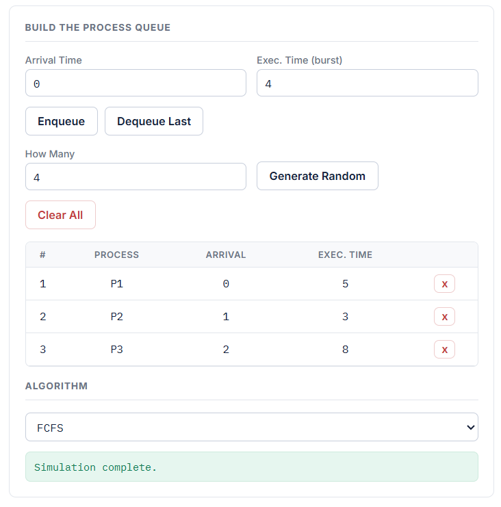
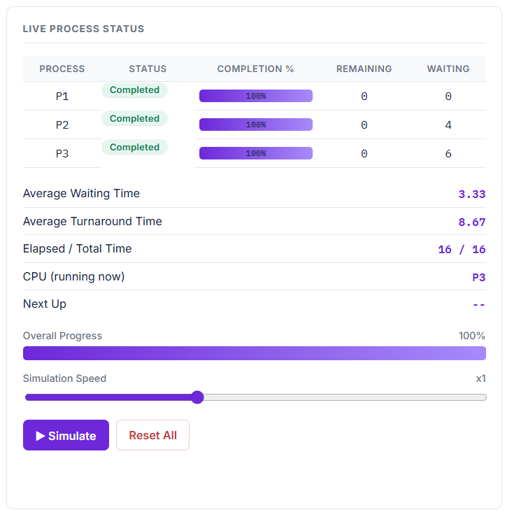

# CPU Scheduling Visualizer

A browser-based simulator that visualizes five CPU scheduling algorithms with an animated Gantt chart, live per-process status table, and computed scheduling metrics.

---

## 1. Overview

This project simulates how an operating system's CPU scheduler decides which process runs when, under five different scheduling policies. You define a set of processes (arrival time + burst time), pick an algorithm, and run the simulation. The tool then:

- Computes each process's **Completion Time**, **Turnaround Time**, and **Response Time**
- Displays a second-by-second **animated Gantt chart** of execution order
- Shows a **live status table** (Status, Completion %, Remaining Time, Waiting Time) that updates as the simulation plays
- Reports **average Turnaround Time** and **average Waiting Time** across all processes

Built entirely with HTML, CSS, and vanilla JavaScript — no frameworks, no build step, no server required.

---

## 2. How to Run

1. Download/clone this repository.
2. Keep `index.html`, `style.css`, and `script.js` **in the same folder** — `index.html` loads the other two by relative path, so moving it alone will break the styling and logic.
3. Open `index.html` directly in any modern browser (Chrome, Edge, Firefox).

No installation, no dependencies, no local server needed.

### Using the tool
1. Enter a process's **Arrival Time** and **Exec. Time (burst)**, click **Enqueue** — or click **Generate Random** to fill the queue automatically.
2. Choose an **Algorithm** from the dropdown. For Round Robin / MLFQ, a **Time Slice** (and, for MLFQ, an **Allotment**) field appears — adjust as needed.
3. Click **▶ Simulate**. Use the **Simulation Speed** slider to speed up or slow down the animation, even mid-run.
4. Click **Reset All** to clear the simulation and try a different algorithm or process set.

---

## 3. Algorithms Implemented

| Algorithm | Type | Rule |
| **FCFS** (First-Come, First-Served) | Non-preemptive | Processes run strictly in arrival order, each to completion. |
| **SJF** (Shortest Job First) | Non-preemptive | Whenever the CPU is free, the arrived process with the smallest burst time runs next, to completion. |
| **SRTF** (Shortest Remaining Time First) | Preemptive | Re-evaluated every second — the process with the least *remaining* work always runs; a newly arrived shorter job immediately interrupts the current one. |
| **Round Robin** | Preemptive | One FIFO queue; each process gets at most `quantum` seconds per turn, then moves to the back of the queue if unfinished. |
| **MLFQ** (Multilevel Feedback Queue) | Preemptive | Four priority queues (Q0 highest–Q3 lowest). Processes start at Q0 using Round Robin; after accumulating `allotment` seconds at a level, they're demoted one level down. New arrivals always enter at Q0. |

---

## 4. Sample Input & Expected Output

**Input:**

| Process | Arrival | Burst |
| P1 | 0 | 5 |
| P2 | 1 | 3 |
| P3 | 2 | 8 |

**Expected output — FCFS:**

| Process | Completion | Turnaround | Response |
| P1 | 5 | 5 | 0 |
| P2 | 8 | 7 | 4 |
| P3 | 16 | 14 | 6 |

Average Turnaround = 8.67, Average Waiting = (5-5)+(7-3)+(14-8) / 3 = 3.33

**Expected output — Round Robin (quantum = 2):**

| Process | Completion | Turnaround | Response |
| P1 | 12 | 12 | 0 |
| P2 | 9 | 8 | 1 |
| P3 | 16 | 14 | 2 |

Gantt order: `P1[0-2] P2[2-4] P3[4-6] P1[6-8] P2[8-9] P3[9-11] P1[11-12] P3[12-16]`

*(SJF, SRTF, and MLFQ outputs depend on the exact burst times entered — see in-app results after running.)*

---

## 5. Screenshots

**Before running** — process queue filled in, algorithm selected, not yet simulated:



**Mid-simulation** — Gantt chart partially filled, CPU actively running a process:



**Completed** — full Gantt chart, all processes completed, averages calculated:


---

## 6. Known Bugs / Limitations

- **No persistence** — refreshing the page clears the process queue; there is no save/load feature.
- **Integer time units only** — arrival and burst times must be whole numbers; the simulation does not support fractional/decimal time.
- **MLFQ simplification** — this implementation uses a single shared `quantum` and a single shared `allotment` value applied uniformly across all four levels, rather than letting each level have independently configurable values.
- **No Priority Scheduling algorithm** — a user-supplied "priority" field was intentionally left out because none of the five required algorithms use it (MLFQ's priority levels are assigned internally by the algorithm, not by the user).
- **No context-switch overhead modeled** — per the assignment's assumptions, switching between processes is treated as instantaneous.
- **Single-run at a time** — starting a new simulation while one is animating requires clicking Reset All first; there is no pause/resume, only a speed slider.

---

## 7. Contributions

Individual project — completed solo by [Your Name].

| Task | Contributor |
|---|---|
| Process queue UI & input validation | [Your Name] |
| FCFS, SJF, SRTF, Round Robin, MLFQ logic | [Your Name] |
| Animated Gantt chart & live status table | [Your Name] |
| Styling / theme | [Your Name] |
| Documentation (this README) | [Your Name] |

---

## 8. Source Code Structure

```
DeAsis_MiniProject/
├── index.html # Page structure: input form, tables, buttons, Gantt container
├── style.css # All visual styling (theme, layout, colors)
├── script.js # All logic: queue management, the 5 scheduling algorithms,
│             # and the tick-by-tick animation engine
└── README.md # This file
```

- **`index.html`** contains no logic or inline styling — structure only.
- **`style.css`** contains no HTML or JavaScript — styling only.
- **`script.js`** is organized top-to-bottom as: queue-builder functions → five algorithm functions → Gantt/animation engine (see inline comments for a full function-by-function breakdown).
